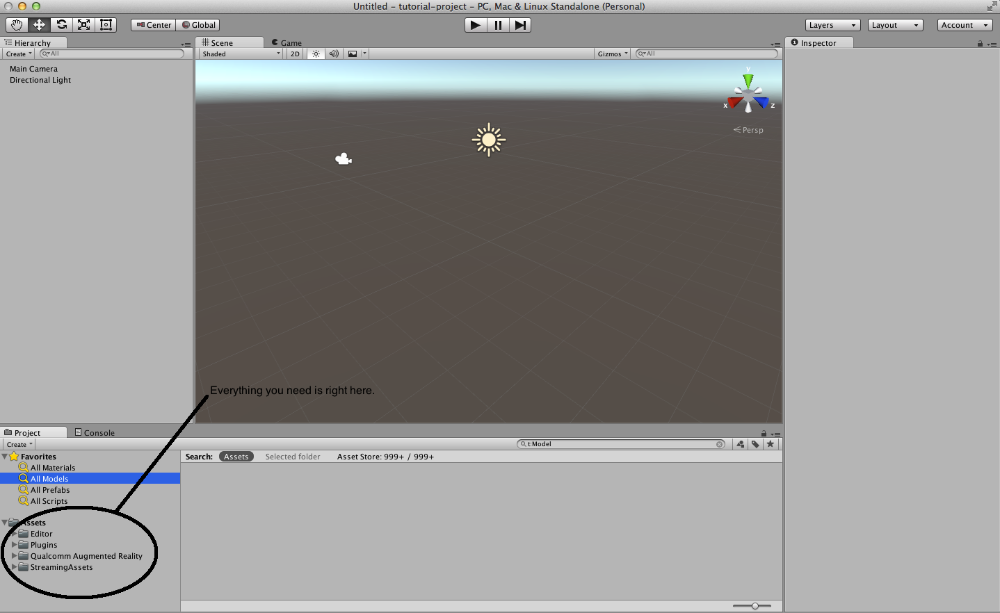
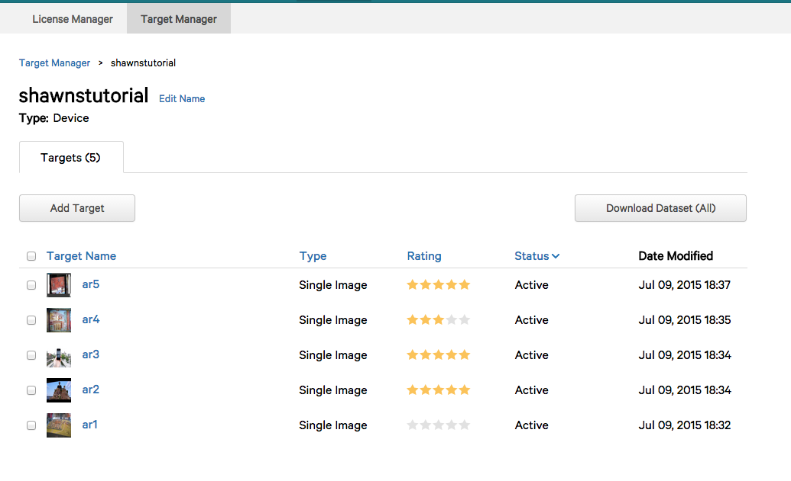
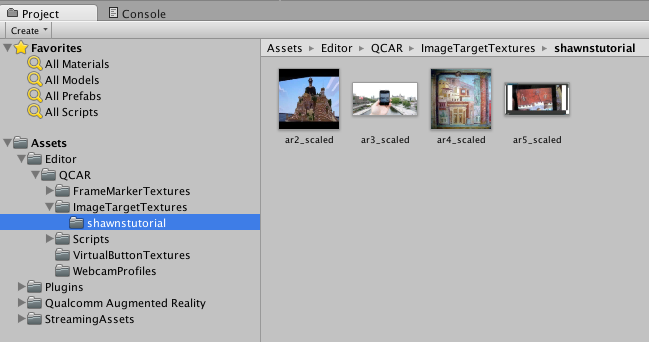

# Augmented reality for archaeology with Vuforia SDK and Unity3d

In the presentation, we saw a number of potential use cases for AR in archaeology. In this tutorial, we'll build a simple AR app that overlays content on the real world, tied to an image or pattern viewed through your smartphone/tablet's camera. 

That is, an AR pop-up book!

(By the way, since the latest version of Unity3d comes with 'stereoscopic' abilities natively enabled, as a further step one could package what we are going to build, with some tweaking, as a google cardboard app). 

For your reference, we are following [this article](http://developer.vuforia.com/library/articles/Solution/Compiling-a-Simple-Unity-Project) from vuforia's developers' library. 

## Ingredients

+ [Unity3d (version 5)](http://unity3d.com/get-unity/download?ref=personal). <small>**nb** the documentation for Unity is excellent. After you've completed this tutorial, try the '[Rollaball](https://developer.vuforia.com/downloads/sdk)' tutorial to explore in more depth concepts such as scripting.</small>
+ [Vuforia Unity Extension](https://developer.vuforia.com/downloads/sdk)  You will need to register with their site, which you will be prompted to do when you download. This only takes a few moments.
+ some tracking images
+ [A license key](https://developer.vuforia.com/license-manager) Login using your vuforia login to create and manage a license key.
+ images [to turn into tracking targets](https://developer.vuforia.com/target-manager). Again, you need to login with your vuforia login to use their  Why not use these images? **link** . [Here's some guidance on what makes a good image, for future reference.](https://developer.vuforia.com/library/articles/Best_Practices/Attributes-of-an-Ideal-Image-Target)
+ The sdk for your chosen mobile device. [Android](https://developer.android.com/sdk/index.html) or [ios](https://developer.apple.com/ios/download/)

(While not necessary for this tutorial, you might like to know how to augment 3d objects, in the manner Eve does in the '[Roman fort](https://vimeo.com/30861262)' video we looked at. You use [this tool](https://developer.vuforia.com/downloads/tool) in conjunction with an android device, to turn the 3d object into xml that the Vuforia sdk can associate with your augmentations.)

## Thinking about metaphors

What makes a pop-up book compelling? Watch this short video - 

What I like about this is that the augmentations _enhance_ the content of the book. They make _sense_, and it's almost as if the sublter, deeper meanings of the text are brought out by the augmentations. They play with, and enhance, the idea of transformation and the monster within. Like for Dr. Jekyll, the monster within can only be brought out using the potion, that is, the magic eye of the AR camera. Digital technology is at its most _affective_ when its metaphors are congruent with the materials.

In this tutorial then I started wondering, what material would it be _most meaningful_ to augment? We're used to the idea of publishing a talk as an essay. The written text conveys something of the show, the performance. We're used to the idea of video or audio taping the talk. But what if the talk was published as an augmented reality book? The task then of this tutorial is to equip you with guidance to remix this morning's talk as a physical-but-digitally-augmented artefact.  

Make sure you've got your ingredients sorted out. Let's begin.

### Setting up your environment

<small>**A word on file names** Life is easier if you do not put spaces or special characters in your file names.</small>

Start Unity. Follow the prompts to make a new 3d project.

Go to Assets > import package > custom package, and navigate to where you downloaded the vuforia unity extension. Select it; it'll be the file named  `vuforia-unity-android-ios-xx-yy-zz.unitypackage`.

A dialogue box will open showing you everything in the package; click 'import'. Your environment will look like this:

#### Setting up your image database.

Go to the [vuforia target manager](https://developer.vuforia.com/target-manager) and log in. We're about to create a database for your app (or you can use this one that I've premade)

Click on the 'add database' button. Select 'device' (we're going to store the database within the app on your device, not in the cloud). Click on the database that you just created. The page that loads lets you upload your images, and assess how good (via number of stars) those images are in terms of their trackability. Click on 'add target' and follow the prompts for uploading. (For width, just use the width in px of the image). I uploaded five images from my presentation:

The target manager indicates that `ar1` is no good for tracking, while `ar4` will be ok; the others will be very good indeed. 

Save a few images from my [presentation](https://github.com/shawngraham/ar-archaeology/blob/master/augment-your-archaeology-draft.md) to your computer, then upload them to the target manager. Add or remove images until you have at least 3 stars for each one.

Hit 'download dataset' and in the popup select 'unity editor'. Double-click that file to import it into your Unity project. The import package window will open again, showing you what's inside; click 'import'.

### Building your scene

The central window of the Unity editor shows us our game, or in this case, our AR scene. In a video game, the 'camera' follows the action around so that the player, sitting in front of the computer, sees the action from that view point. The vuforia sdk comes with an 'AR Camera' that only reveals digital content when your device's camera is pointed at one of our tracking images. So:

That is, delete the default camera, select the 'ARCamera' from within the 'Qualcomm Augmented Reality >> Prefabs' folder, and drag it up to your scene.