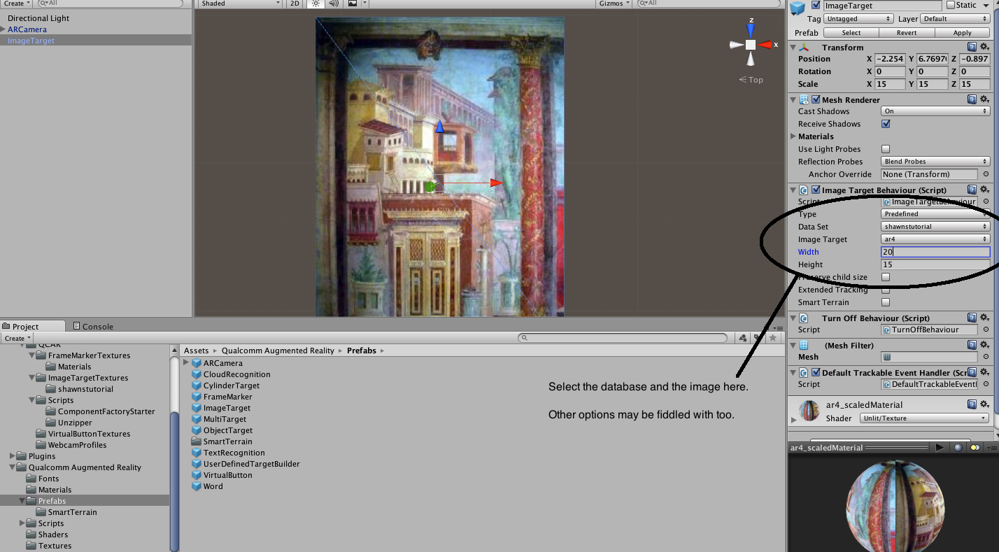
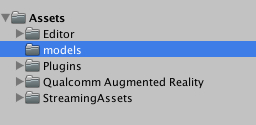
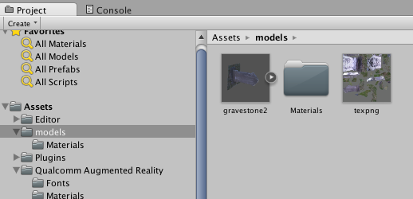
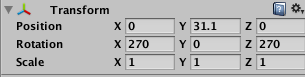
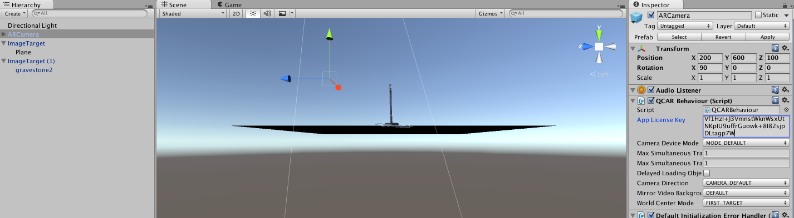
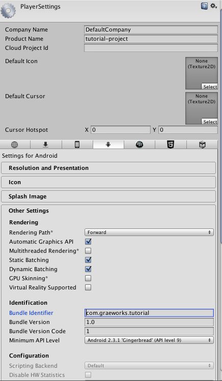

# Augmented reality for archaeology with Vuforia SDK and Unity3d

In the presentation, we saw a number of potential use cases for AR in archaeology. In this tutorial, we'll build a simple AR app that overlays content on the real world, tied to an image or pattern viewed through your smartphone/tablet's camera. 

That is, an AR pop-up book!

(By the way, since the latest version of Unity3d comes with 'stereoscopic' abilities natively enabled, as a further step one could package what we are going to build, with some tweaking, as a google cardboard app). 

For your reference, we are following [this article](http://developer.vuforia.com/library/articles/Solution/Compiling-a-Simple-Unity-Project) from vuforia's developers' library. 

Remember folks, save your project frequently, in a git-enabled folder, for when things go wrong.

## Ingredients

+ [Unity3d (version 5)](http://unity3d.com/get-unity/download?ref=personal). <small>**nb** the documentation for Unity is excellent. After you've completed this tutorial, try the '[Rollaball](https://developer.vuforia.com/downloads/sdk)' tutorial to explore in more depth concepts such as scripting.</small>
+ [Vuforia Unity Extension](https://developer.vuforia.com/downloads/sdk)  You will need to register with their site, which you will be prompted to do when you download. This only takes a few moments.
+ some tracking images
+ [A license key](https://developer.vuforia.com/license-manager) Login using your vuforia login to create and manage a license key.
+ images [to turn into tracking targets](https://developer.vuforia.com/target-manager). Again, you need to login with your vuforia login to use their  Why not use these images? **link** . [Here's some guidance on what makes a good image, for future reference.](https://developer.vuforia.com/library/articles/Best_Practices/Attributes-of-an-Ideal-Image-Target)
+ The sdk for your chosen mobile device. [Android](https://developer.android.com/sdk/index.html) or [ios](https://developer.apple.com/ios/download/). Download and install; make a note of where the sdk lives on your machine.

(While not necessary for this tutorial, you might like to know how to augment 3d objects, in the manner Eve does in the '[Roman fort](https://vimeo.com/30861262)' video we looked at. You use [this tool](https://developer.vuforia.com/downloads/tool) in conjunction with an android device, to turn the 3d object into xml that the Vuforia sdk can associate with your augmentations.)

## Thinking about metaphors

What makes a pop-up book compelling? Watch this short video - 

[](https://www.youtube.com/embed/7d7tTcSFZas)

What I like about this is that the augmentations _enhance_ the content of the book. They make _sense_, and it's almost as if the sublter, deeper meanings of the text are brought out by the augmentations. They play with, and enhance, the idea of transformation and the monster within. Like for Dr. Jekyll, the monster within can only be brought out using the potion, that is, the magic eye of the AR camera. Digital technology is at its most _affective_ when its metaphors are congruent with the materials.

In this tutorial then I started wondering, what material would it be _most meaningful_ to augment? We're used to the idea of publishing a talk as an essay. The written text conveys something of the show, the performance. We're used to the idea of video or audio taping the talk. But what if the talk was published as an augmented reality book? The task then of this tutorial is to equip you with guidance to remix this morning's talk as a physical-but-digitally-augmented artefact.  

Make sure you've got your ingredients sorted out. Let's begin.

### Setting up your environment

<small>**A word on file names** Life is easier if you do not put spaces or special characters in your file names.</small>

Start Unity. Follow the prompts to make a new 3d project. I called mine 'tutorial-project'.

Go to Assets > import package > custom package, and navigate to where you downloaded the vuforia unity extension. Select it; it'll be the file named  `vuforia-unity-android-ios-xx-yy-zz.unitypackage`.

A dialogue box will open showing you everything in the package; click 'import'. Your environment will look like this:


#### Setting up your image database.

Go to the [vuforia target manager](https://developer.vuforia.com/target-manager) and log in. We're about to create a database for your app (or you can use this one that I've premade)

Click on the 'add database' button. Select 'device' (we're going to store the database within the app on your device, not in the cloud). Click on the database that you just created. The page that loads lets you upload your images, and assess how good (via number of stars) those images are in terms of their trackability. Click on 'add target' and follow the prompts for uploading. (For width, just use the width in px of the image). I uploaded five images from my presentation:


The target manager indicates that `ar1` is no good for tracking, while `ar4` will be ok; the others will be very good indeed. 

Save a few images from my [presentation](https://github.com/shawngraham/ar-archaeology/blob/master/augment-your-archaeology-draft.md) to your computer, then upload them to the target manager. Add or remove images until you have at least 3 stars for each one.

Hit 'download dataset' and in the popup select 'unity editor'. Double-click that file to import it into your Unity project. The import package window will open again, showing you what's inside; click 'import'.


### Building your scene

The central window of the Unity editor shows us our game, or in this case, our AR scene. In a video game, the 'camera' follows the action around so that the player, sitting in front of the computer, sees the action from that view point. The vuforia sdk comes with an 'AR Camera' that only reveals digital content when your device's camera is pointed at one of our tracking images. So:


That is, delete the default camera, select the 'ARCamera' from within the 'Qualcomm Augmented Reality >> Prefabs' folder, and drag it up to your scene.

Notice in the prefabs folder that there is something called an 'image target'. This is an object that you will be attaching one of the tracking images to. Grab the image target prefab and drag it up into your scene. Notice that the inspector window on the right side of the unity editor changes to show you all of the various configurable options ofr your image target.

Under 'data set' and 'image target' select the image database and the desired image.



### Setting up your assets

Find your unity project's assets folder on your computer. Mine is at /Users/shawngraham/unityprojects/tutorial-project/assets. By the way, I created a new folder there called 'models'. I'm going to put any 3d models I wish to use as an augmentation in that folder. Once you've created that folder, notice that it appears in your unity folder tree:



Let's say we had a bunch of 3d models we wanted to use. In the [img folder](img/) there is a file called 'gravestone.dae' and its associated texture is 'texpng'. Save those into that models folder. In your unity editing window, the model will appear, already associated with its texture.

Let's also say that we wanted a audio clip to play whenever the user's device focused on that image of Roman second style painting ([ar4.png](img/ar4.png) in this repo's img folder). Take [movie1](https://dl.dropboxusercontent.com/u/37716296/movie1.mp4) and save it to _the assets folder_ (and **not** the models subfolder we just created). 

### Tieing assets to triggers

#### Making a 3d model appear

Click on 'gravestone2' in your editor:



and drag it into your scene. It should appear! It's lying on its side, and we'll want to move it around a bit, but first let's associate it with that imagetarget you created earlier. In the hiearchy pane at the top left, drag 'gravestone2' so that it is on top of 'imagetarget'. It'll look a bit like this:


This means that when your device spots that particular tracking image, it will display the 3d model of the gravestone. Now comes the tricky part of setting your gravestone on the image the way you want it to show up through your device's camera. These settings:

 

seem to work.

#### Adding a sound clip

Load a new image target into the scene.

Create a new c# script by assets> create > c# script

The script will appear in the assets panel at bottom. click to rename it: ImageTargetPlayAudio.cs

Double click to edit it; it will open in an editor. Delete the default script, and then paste the below:

```cs
using UnityEngine;
using Vuforia;

public class ImageTargetPlayAudio : MonoBehaviour,
ITrackableEventHandler 
{
	private TrackableBehaviour mTrackableBehaviour;
	
	void Start()
	{
		mTrackableBehaviour = GetComponent<TrackableBehaviour>();
		if (mTrackableBehaviour)
		{
			mTrackableBehaviour.RegisterTrackableEventHandler(this);
		}
	}
	
	public void OnTrackableStateChanged(
		TrackableBehaviour.Status previousStatus,
		TrackableBehaviour.Status newStatus)
	{
		if (newStatus == TrackableBehaviour.Status.DETECTED ||
		    newStatus == TrackableBehaviour.Status.TRACKED ||
		    newStatus == TrackableBehaviour.Status.EXTENDED_TRACKED)
		{
			// Play audio when target is found
			GetComponent<AudioSource>().Play();
		}
		else
		{
			// Stop audio when target is lost
			GetComponent<AudioSource>().Stop();
		}
	}   
}
```

Back in the scene, select the image target. 

Add component (button, bottom right of the editor). select scripts > ImageTargetPlayAudio

Add component > audio source.

Meanwhile, in your finder, drop the mp3 file into the project's 'assets' folder. The mp3 will appear in the unity editor window in assets.

ImageTarget is still selected in the hierarchy; Drag the mp3 file to the audio source panel under the inspector window - drag it right into the 'audioclip' box.

...You now have an image target that triggers audio!

### Let's test this out.

Before we can test this out, we have to get a licence key from Vuforia. Go to [license key manager](https://developer.vuforia.com/license-manager) and make a new licence key. In Unity, select the ARCamera, and then in the inspector on the right hand side of the screen, paste your key in the relevant box:



Save your project!!

Plug your device into your computer. For an android device at least you have to have 'developer options' enabled on your machine, and turn on 'USB debuggin'. Google for specifics on your device.

Now, under file select 'build and run'. Unity will ask you for some more information - it'll want to know for what operating system. I select Android; the first time I did this, it wanted to also know the location of the android sdk on my machine. Mine is at Users\shawngraham\Library\android-sdk-macosx. 

Then, Unity will want to know what 'scenes' are in your project. Click 'add current'. It will prompt you to save the scene first; call it 'scene1'. Hit 'build and run' (Unity will ask for a name for your app). You might have to adjust 'player settings':



If all goes well, your app will open on your device! Aim it at a tracking image. 
