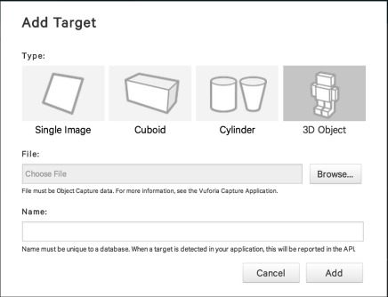

# Generating a 3d model with 123D Catch

Autodesk has a suite of programs connected with 3d modeling. [123D Catch](http://www.123dapp.com/catch) is a free offering. The mobile apps let you take a series of photos which are then pushed to Autodesk HQ for processing; you can then log into their website to examine the model and download it (as .obj). So, install the app on your ios, android, or windows phone device. The first time you use it, you will have to do the usual registering and setting up of an account. 

*Warning* 123D Catch doesn't work on IOS6 devices. Folks so afflicted should try the desktop version (see below, and only if they have a windows machine; if you've a mac you might be able to run it under parallels or similar. I've tried running it under [Wine Bottler](winebottler.kronenberg.org) on the mac but it doesn't seem to work that way, sadly). Worse comes to worse, skip ahead to the [VSFM tutorial](3d%20model%20building%20with%20VSFM%20on%20the%20command%20line.md) and give that a shot. Also, check out this guide from [Micropasts at the British Museum](http://research.micropasts.org/2014/06/13/3d-modelling-via-sfm/).

## Photography

Have someone sit as still as possible in a chair. Open the app, hit the big + button, and then the '+ start a new scan'. Start taking photographs. Move around your subject, move in and out, from on high and down low. You want to have a high degree of overlap - the software works by identifying matching overlapping points between photos. A point will end up in your final model if it is visible in at least three photographs ([see Peter Falkingham's helpful tips here](http://www.academia.edu/3649828/Generating_a_Photogrammetric_model_using_VisualSFM_and_post-processing_with_Meshlab)). Around 40 photos is not unreasonable. I have made decent models with as few as 12 photos, occasionally. (Now, if you are building models for metrics etc, it's preferable to have a more standardized approach, and you'd probably be using Photoscan - see the guidelines from Micropasts linked to above, or the discussion in [Brandon et al](http://www.maneyonline.com/doi/full/10.1179/0093469013Z.00000000056)).

Don't use a flash; don't mount your object (or person, for that matter) on a turntable. You and the camera do the moving, not the object. Abby Crawford, of [Archaeological Graphics](http://www.archaeologicalgraphics.com) has excellent [pointers for this kind of work here](http://blog.sketchfab.com/post/121838008009/how-to-set-up-a-successful-photogrammetry-project).

When you think you have enough, press the checkmark. All of your photos will be displayed; you can delete any blurry ones. If you like what you've got, hit the check mark again.  The app will then upload your photos to the servers for processing; a helpful little 'loading' doodad lets you know when they're all uploaded. When the status bar says 'ready' and there's another checkmark beside a thumbnail of your model, you can either review it in the app and make it public or you can log in to their website and work with it there. I'd suggest the latter.

If the upload fails, you have to close the app completely and re-login. This has been happening a lot to me lately.

When you're in the Autodesk website for 123D Catch, you go to your 'models' page, and hit the download button. They'll package everything up for you:

...which, when unzipped, looks like this:

The .stl file can be used for 3d printing; the mesh folder contains the .obj file with the actual geometry of your model, an .mtl file that can be opened with a text editor (and describes which texture file goes with the mesh), and a .jpg that shows the model. We'll use all these in [Meshlab](http://meshlab.sourceforge.net/).

## Desktop PC app

The desktop PC app is an enormous pain in the rear. It too requires you to login to the autodesk servers before it will run, although if you hit 'create new' you can start working with it and login only when you're ready to upload. I'd suggest not bothering with it, as most times the mobile app works fine enough. If you do install it, it can be handy if you are working with photos you've taken with your own camera, or if you want to manually identify, one by one, points that appear in three different images. 

You can also add reference points (and thus volumes) to your 3d models using the desktop PC app - [this page](http://www.123dapp.com/howto/catch) has many video tutorials that can guide you through this process.

-----

That's all there is to it. It's possible to generate models from video stills too - you have to slice the video into individual frames. It's also possible to generate models from photographs from many different cameras. There are many different tools that can build point clouds and then meshes from photography - Ryan Baumann [does some comparison model building here](http://ryanfb.github.io/etc/2015/07/27/qualitative_photogrammetry_comparisons_gallery.html). [Photoscan from Agisoft](http://www.agisoft.com/) is good value for money, and is reasonably priced. You can use it for free - but the free version doesn't let you save your final model.  The basic workflow in Photoscan is very straightforward. Start the program, and then in the toolbar click 'workflow'. The first item is 'select photos'. You do that. Indeed, you simply work through each option in turn as they become available:

Agisoft's [own tutorial](http://www.agisoft.com/pdf/PS_1.0.0%20-Tutorial%20(BL)%20-%203D-model.pdf) will get you started easily. Agisoft is good too when you want to create models that are dimensioned.

But - 123D catch uploads all your photos to servers who-knows-where (and do we ever read the TOS very carefully?) And maybe you don't have the money to purchase a tool like Photoscan. The [VSFM](ccwu.me/vsfm/) package can be used (for free) and keeps everything under your own control. Getting it up and running is not easy, but it's not that hard. [Here's a tutorial that uses VSFM and also includes a workflow for downloading youtube drone videos, slicing the videos into stills, and stitches them altogether](3d%20model%20building%20with%20VSFM%20on%20the%20command%20line.md)

## Simplifying a model

Sometimes, the models we generate are _huge_. We need sometimes to make them more digestible. There are a couple of ways of doing that. The first involves reducing the complexity of the model. Make a copy of your model folder that you downloaded from Autodesk, so that you've got the original in case (when undoubtedly) things go wrong.

Start Meshlab; click on file -> import mesh. Select the .obj file for your model.
Select filters -> Remeshing, simplification, and reconstruction -> quadratic edge collapse decimation. In the dialogue box that opens, you can set a target for the desired number of faces you want. Now, I always try to reduce in small steps; I have the rest of my settings as in the image below [which is from this tutorial](http://www.shapeways.com/tutorials/polygon_reduction_with_meshlab)

You can also make your model less heavy by editing the texture files directly. They will be square; if the texture file is 1024 by 1024, resize the image in your favourite image program to 521 by 521. 

(_By the way_, if you find yourself using the Aurasma AR platform, they require models in .dae format. Meshlab can convert from .obj to .dae, but I've found that Aurasma is finicky, and is expecting the _particular_ flavour of .dae that is generated by Blender. Here's Aurasma's [guidance on the subject](www.aurasma.com/wp-content/uploads/Aurasma-3D-Guidelines.pdf)).

## Sharing your models

Sketchfab, and indeed most services that will display 3d models for you, require you to put the .obj, .mtl, and .jpg files into a single zip file. Incidentally, github can render .stl files (and show their revision history in 3d!) [see here for more](https://help.github.com/articles/3d-file-viewer/).

In my opinion, the two best places for sharing your models are [Sketchfab](http://sketchfab.com) and [p3d.in](http://p3d.in). They both have free and pro accounts, with differing offerings. Sketchfab [has an API amongst other things](http://blog.sketchfab.com/tagged/tutorial) (Photoscan users can upload directly to Sketchfab from within Photoscan). Sketchfab has Oculus Rift & Cardboard support - ie, stereoscopic display - to show your 3d models in, erm, 3d. Every model has its own url; you simply add `/embed?oculus=2` to the end of it, hit the play button, and voila, steroscopic 3d models. Here's one my first year students made a few years back: [Terracotta from Jalisco](https://sketchfab.com/models/30939eb07d8f48d0802ab9dc7196241d/embed?oculus=2). You can also annotate models in the Sketchfab viewer - LFHooper has been uploading models of excavation trenches [annotated with context and finds numbers](https://sketchfab.com/models/078b30b3f6354ab6af07b3a54c6d5fcd). And of course you can make your model downloadable for sharing if you desire (being able to download models is a paid feature of p3d.in). When I want to embed a 3d model in another webpage (say, a Neatline powered Omeka map exhibit, or a Twine story-game), I find that the p3d.in embed seems 'cleaner', with less branding and borders, than the Sketchfab embed. I sometimes will have the same model in two different places for those kinds of reasons.

Go ahead and create an account on Sketchfab, then hit upload model. Select the zip file containing your .obj mesh, .mtl information, and .jpg texture. Now, when you first view your model on Sketchfab, you might be surprised. Many of my models - for whatever reason - first show up upside down! But it's easy to fix the orientation, the colouring, the lighting, and so on by clicking on the 'settings' button and then '3d settings'. In the image below I have a model of the colosseum (which I built from extracted still images from a drone video I found on youtube) open in Sketchfab at the 3d editing settings:

At the top left, you can edit the scene, the lighting, and the annotations. With free accounts, you can only have 5 annotations, by the way. Under 'scene', you can adjust the model's orientation by clicking on the x, y, and z buttons. These will rotate the model around the x, y, and z axes:

X is the red line, Y is the green line, and Z is the blue line. When you've got everything the way you like it, click 'save view' and then 'save settings'.

*Update: A note on rotation* [Atomrab](https://github.com/atomrab) tells me:
>Sketchfab has a rotation lock, so you can't rotate the images all the way around -- and it takes the rotation axis from the 123DCatch capture in a non-transparent way, so if you just go straight from 123DCatch to Sketchfab, you often end up with an object that's aligned sideways and won't rotate in the way you'd want it to (this happened a lot with my student projects: eg [https://sketchfab.com/models/b037e1301c3248ca966d4d610442534e](https://sketchfab.com/models/b037e1301c3248ca966d4d610442534e)). You can fix this in Meshlab, but you have to realign the model within the rotation trackball. [p3d.in](http://p3d.in) doesn't have a rotation lock, so you can always get it to where you want it as a user (but then you can't have annotations).

## rolling your own online viewer

I haven't played with this yet, but Micropasts has code for your own viewer here: [https://github.com/MicroPasts/MicroPasts-3Dview](https://github.com/MicroPasts/MicroPasts-3Dview). I promise to play with this and write up my process as soon as possible. If you have materials that are sensitive, or you wish to keep everything under your own control then this is (the/one) solution for you to try! Quickly, it looks like you should be able to get it up and running fairly quickly: Fork that repository, create a gh-pages branch, load your .obj into the examples folder and change the relevant lines in index.html (around line 260) to point to your model. The finished viewer [looks like this](http://shawngraham.github.io/MicroPasts-3Dview/#). You could embed this into your own website with a simple iframe.

## Augmenting reality with 3d printing!

Remember that .stl file that 123D Catch created for you? That's the typical file type that most 3d printers accept. Sketchfab has [an excellent blogpost](http://blog.sketchfab.com/post/100752713569/3d-print-a-model-downloaded-from-sketchfab) on the things to remember when printing a model. It's beyond our scope in this workshop to go into 3d printing, but imagine you've 3d printed an aerial drone shot of your excavation. You could paint colours on to it - and then [scan the print into a trackable for Vuforia](https://developer.vuforia.com/library/articles/Training/Vuforia-Object-Scanner-Users-Guide) & create an AR application that overlays digital materials onto your 3d print in the real world! Once you've scanned it using Vuforia's scanner, you can upload that data to their tracking manager just as you would a 2d image:

.

You could even use Unity to populate your AR with little non-player characters, the way that Stu Eve did for his [augmented Roman Fort!](http://www.dead-mens-eyes.org/augmenting-a-roman-fort/)

With 3d photogrammetry, AR, and 3d printing, the physical and digital worlds can be made to collide in quite interesting ways... digital materialism, eh?
