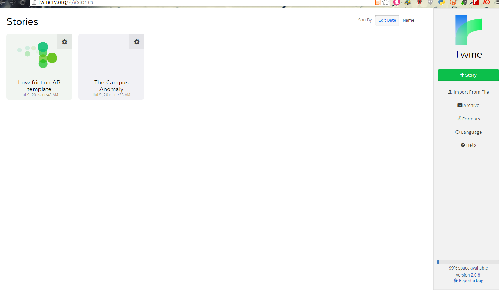
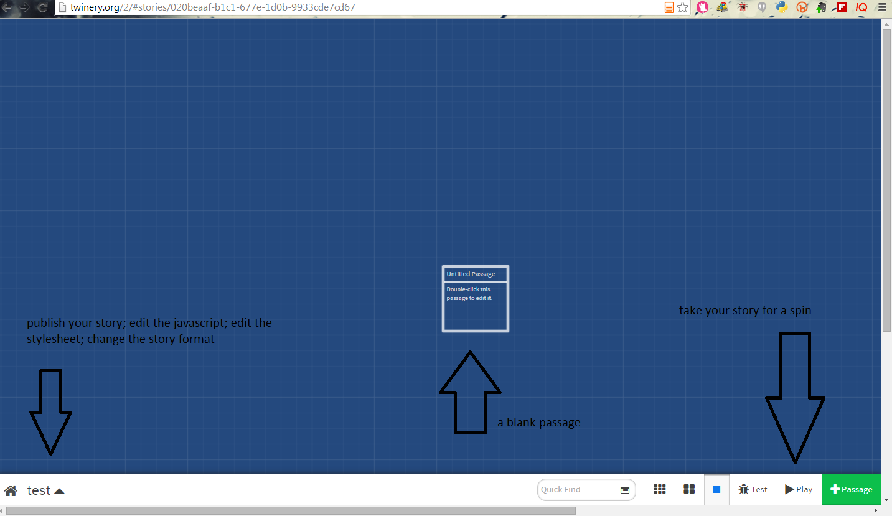
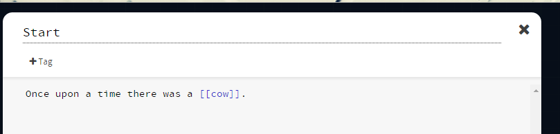
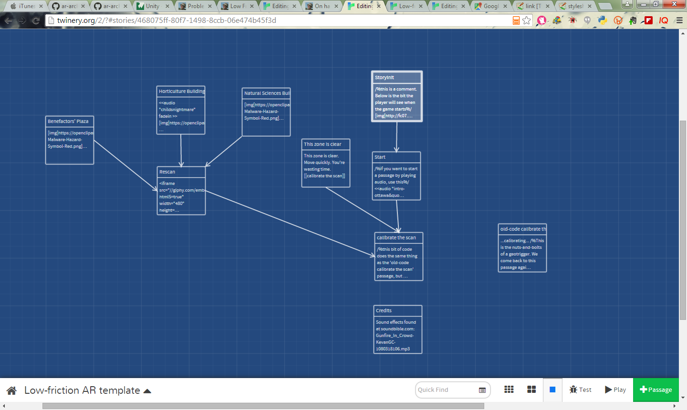

# Low friction Augmented Reality using Twine

I call this _low friction_ because

1. the app for building this works rather like a text-editor
2. the coding is minimal
3. the app itself lives as a webpage and so is fairly accessible no matter what device the user has (provided they have geolocation abilities, obviously)

...and this is 'hacking' because Twine is meant to make choose-your-own-adventure type games; it was never envisioned to use it with geolocation. What we'll do then is hack the ability to trigger passages of text through physical proximity to a particular location (a 'geotrigger'). If you haven't played any Twine-type games, try ['Beneath Floes'](http://www.bravemule.com/beneathfloes) first. (Here's a great review on [Killscreen](http://killscreendaily.com/articles/escape-icy-clutches-inuit-legend-beneath-floes/)).   [Profhacker](http://chronicle.com/blogs/profhacker/tag/twine) has written about the pedagogical potentials of Twine several times. 

## Ingredients
+ [Twinery 2](http://twinery.org/) (which you can run as an executable or within your browser*)
+ Server space to upload your final html to (gh-pages works; public dropbox works if you still have that feature; [philome.la](http://philome.la/) if you don't want to futz with all of that.)

**NB** If you use Twinery in your browser, your game is saved in the browser's cache. Clear the cache, lose your game. You've been warned. [Please read this 'Where your stories are saved'](http://twinery.org/wiki/twine2:where_your_stories_are_saved)

> This tutorial builds [this experience](http://shawngraham.github.io/ar-archaeology/workshop%20materials/Low-friction%20AR%20template.html). That file is being served up by gh-pages, by the way. Try playing this on a tablet or phone (or lug your computer around) outside first; you can also right-click on that link, save the html to your computer, and then load it up in [Twinery 2] to see how it all works if you're impatient. Read through this tutorial first before trying to build, I'd suggest.

### Thinking about story

Does the story come first? Or does the place? Are we generating a kind of audio tour guide, or are we going for something more playful? This is your call - but I find it helps to first sketch out the kind of experience you wish to generate. As I thought about this tutorial, I came across an idea by [Mark Sample](http://www.samplereality.com/2010/06/01/haunts-place-play-and-trauma/) that draws on the idea of 'heterotopia' "a single real place in which incompatible counter-sites are layered upon or juxtaposed against one another." [More on what this could mean for archaeology here](http://electricarchaeology.ca/2015/05/25/on-haunts-low-friction-ar-thinking-out-loud/). On these lines, maybe this AR is about a single event in MSU's past, which has left echoes in the firmament which the player's device is able to read. By finding these echoes, and thinking about them, competing stories emerge. The past is messy... (inspiration here also from [her story](http://www.herstorygame.com/).)

The rest of this tutorial will be about the mechanics of getting such an experience up and running; content is up to you.

### Basic Twine Concepts

Go to [Twine](http://twinery.org) and click on '[use it online](http://twinery.org/2/#stories)'. Your screen will look like this:



Yours of course won't have any stories. Click the green +story button to start a new story. Call it 'test' and then hit the add button. You will be presented with the black editor screen:



If you double click on the passage, the passage editor itself opens up. It's fairly intuitive; give the passage a name, and type the story text where it says 'double-click this passage to edit it'. Call this passage 'start' and write something:

> Once upon a time there was a cow.

Now, to add a new passage, put double square brackets around the word cow. Click the 'x'.



A second passage appears on your blueprint, with an arrow showing how the first passage points to the next! Double click the 'cow' passage and add some description. Hit 'play' to see what happens next. By the way, you can leave comments to yourself within a passage that won't show up when playing by using `/%` and `%/` to start and end the comment.  

You've now built a (very small, very simple) interactive fiction in Twine. *Now* let's get complicated.

## Recipe

### Twine, Javascript, and the geolocation API

Twine can be extended by using Javascript. Its look and feel can be customized by using CSS. Its core functionality can be altered by using formats. All of these options can be modified by clicking the up arrow beside the title of your story, in the bottom left part of the editor window. If you click that arrow, then click 'Story Format', you'll see there are three default formats. (More can be added; search the Twine documentation for how). Those formats also come with particular stylesheets. Most of the time, we switch formats just for the styles - but they also come with different macros & functions (more on that in a moment). If you click 'stylesheet' from your menu, you can pump in your own [CSS](http://twinery.org/wiki/stylesheet). Finally, the 'javascript' option allows us to define functions that we can call from within the text of our passages.

Close your test story and then open a new Twine editor window (http://twinery.org/2/#stories)

Your test story appears! Twine automatically saves all your work, which is nice. Notice also the 'Import from File' button. You can use this to load up a Twine .html file into the editor; the editor will parse it back into its constituent passages, stylesheets, format, and javascript. In the repo for this tutorial is a file called [Low-friction AR template](Low-friction AR template.html). <- Save that link to your computer. In the Twine editor, hit the 'Import from File' button and select 'low-friction AR template.html'. You should see this:



In this template, I've already put together a working location-based AR experience built around Benefactors' Plaza. Before we go any further to consider how to use this template, select the up arrow beside the story name (bottom left hand corner of the editor window, remember) and click on 'edit story javascript'.

There are two functions defined here. The first calls the device's browser asking for the geolocation ([documentation on the api here](https://developer.mozilla.org/en-US/docs/Web/API/Geolocation/Using_geolocation)). Study the code; it is passing the device's latitude and longitude to a variable called $Location which we can use in any part of a passage's text. **Variables are marked by $**. Click on the 'start' passage and you'll see this in action:

> Currently you are at $Location.latitude and $Location.longitude which is on the cusp of an area of thin dimensional stability. Our research indicates the strongest concentration is somewhere near the old horticulture building. You should start there.

The second function allows for us to compare the user's position within a buffer defined in the story around a given point of interest.  These two functions are the core for getting Twine to know where it is in physical space.

### Selecting our points of interest

Speaking of points of interest, let's generate a list of points-of-interest. Let's use these ones:

42.7314418,-84.4769123 (south east side of Benefactor's plaza, by the Natural Sciences building)
<br>42.73199,-84.4780939 (north west side of Benefactor's plaza, by the Horticulture building)
<br>42.7317947,-84.4777639 (centre of Benefactor's plaza)

More points can easily be grabbed by going to google maps and double clicking on the point you're interested in. The latitude and longitude turns up in the browser:

https://www.google.ca/maps/@42.7315458,-84.4779326,18.5z

(The final '18.5z' is the zoom level, by the way). 

Grab one more point to use in your app. 

**Important** we can't expect the player to find the _exact_ point we've selected - we have to make a kind of buffer, a bit of a plus/minus. In the app itself (you'll see in a moment) we set a 'buffer' variable of 0.0005 to add and subtract from our points. The effect is to draw a kind of box around the point. Don't select points whose boxes overlap!

### Initializing our variables

The first passage in our story is called 'StoryInit'. Double click on that passage. There's no text in that passage that the player reads, other than a link to the 'Start' passage. This passage is where we define our points of interest, and, if we're using sound in this story, where we load that up. *The story format that we're using is Sugarcube*. This is important, as far as sound goes, because this format comes with default macros that handle sound (in this template, any time you see a macro with 'audio' in it, that's courtesy of [Sugarcube](http://www.motoslave.net/sugarcube)). The other default formats in Twine don't have these macros. A macro in twine is marked off by `<<` and `>>`. 

In this passage we **set** the $buffer variable to allow a buffer of a few metres around our points. We set the lat and long for each of our points:

```twine
<<set $natsciencelat = 42.7314418>> 
<<set $natsciencelong = -84.4769123>>

<<set $horticulturelat = 42.731973>> 
<<set $horticulutrelong = -84.478518>>

<<set $benefactorsplazalat = 42.731785>> 
<<set $benefactorsplazalong = -84.477802>>
```

You can **add your fourth point** by uncommenting out the bit for ANOTHERPOINTlat and ANOTHERPOINTlong - delete the comment and its flags `/%  ...  %/`, give your point a sensible name, and pasting in your coordinates.

At the bottom of this passage I've commented out some code for loading up audio. Put any sound files in the same folder where your Twine html file will be served from, in order for this to work best. (I originally just pointed to various sound files around the web. This doesn't work very well, and isn't good digital citizenship.)

### How to scan for a geotrigger, adding the same

The 'start' passage sets the story for our player, and makes a call to the $Location function to report the player's position. This lets us know that everything is working. If the player gets a 0 0 reading, you might want to tell the player to turn on or allow their device to read its geolocation. I've also included an iframe embed of a 3d model on this page just to show how Twine can do pretty much anything you'd expect an html page to do. Having 3d models in your passages might be a useful/fun/interesting dynamic for your game. Maybe the player has to study the model to figure out where to go next, for instance. This passage then links to the 'calibrate the scan' passage. 

Open the 'calibrate the scan' passage. This passage calls the second function we defined in our javascript, 'approxEqual'. If you go back and check that function on the javascript page, there's a line:

`	allowedDiff = allowedDiff || 0.0005;`

That's your buffer. You can adjust it as you wish. (Back in the 'StoryInit' we had set a variable called 'buffer'; to see that variable in action, look at the passage called 'old-code calibrate the scan'. That shows a less elegant way of comparing the user's position to our points of interest. This old-code passage is not connected to any other passage, and so does not function in the story.)

Our 'calibrate the scan' passage looks at `$Location` as reported by the device, and compares that to the coordinates for our first location,` $natsciencelat` and `$natsciencelong`. If we have an approximate match, it will `<<display>>` the passage called "Natural sciences Building"; if not, it'll look at our next one in the list, and so on. The `<<display "name of passage">>` loads up the relevant passage.

**Add** one last elseif block to put your fourth point of interest into this code.

### Passages for our POIs

If you look at the editor screen, you'll see three passages that describe our points of interest. Each one of these connect to a passage called 'Rescan'. 'Rescan' connects back to 'calibrate the scan'. We could just link directly from the passage describing the POI to 'calibrate the scan', but I deliberately make this a two step process so that we force a new call to the geolocation API. 

Let's look at the passage 'Natural Sciences Building'. In the passage I've created a link, using square brackets, to a png file at openclipart.org. This shows you how you could add your own images to the passages. There is also a macro that starts a sound file, `<<audio "opendoor" play>>`. Check the Sugarcube documentation for other things you can do with audio (fade in/out, loops, etc). There's a bit of descriptive text which for testing purposes, just allows us to make sure (whilst playing) that the correct text is being called while we are in the correct place. Change this up if you wish. Then there is an internal link to the 'rescan' passage. Copy all of this passage to your clipboard.

To make a new passage in Twine, we have to create a link to it. Since (for the purposes of this tutorial) we don't want POIs of interest to be linked via text - we only want them discoverable via movement - we'll add a link in this passage, edit the new passage, and then delete the link. Write a new link like so:
`[[the-name-of-your-new-poi-as-stated-in-the-previous-section]]`

and close the 'Natural Sciences Building' passage.

Double click on your new passage, paste in the bumpf you put on your clipboard. Make sure the name of this passage is exactly the same as what was put in the `<<display>>` code from the 'How to scan for a geotrigger' section, above. Close this passage. Since this passage contained a link to the 'Rescan' passage, the link appears in the editor.

Go back to the 'Natural Sciences Building' passage, and delete the link to the passage you just created.

### Congratulations, you've made an AR app!

You now have an interactive fiction where the passages are triggered by physical presence at a place in space. That is to say: you've got a kind of augmented reality, an app that allows the player to perceive her surroundings differently. The only thing left to do is to publish it to the web so we can go play it. At the bottom left side of the editor screen, hit the up arrow. Hit 'publish to file'. It will turn your story into an html file, which you can find in your downloads folder.

I joined dropbox ages ago, and so have a 'public' folder that can be used to serve webpages. I often put my twines in there. Upload yours to your server, or the gh-pages branch of a github repo, or similar to try your app out. Load it up in your device (ie point your browser to the .html file), make sure geolocation is turned on, and go outside to try it out. [Here's the template game](http://shawngraham.github.io/ar-archaeology/workshop%20materials/Low-friction%20AR%20template.html) (there's a deliberate glitch - see if you can fix it. It doesn't affect the playing of the game, but just shows how one passage can call another).

## Acknowledgements

I originally had the [idea about geotriggers in twine some time ago](http://twinery.org/forum/discussion/2789/geolocation-as-trigger) but with no sense of how to do it, I turned to the user community. Never forget what a resource your fellow travellers can be! [GreyElf](http://twinery.org/forum/profile/270/greyelf) and [TheMadExile](http://twinery.org/forum/profile/7/TheMadExile) solved the problem - and if you read their posts, discuss further ways the code can be improved. Stu Eve, Tara Copplestone, Katy Meyers Emery, Rob Blades & Ryan Pickering road tested the code, the tutorial, and the app at various stages. 

My thanks to you all.
